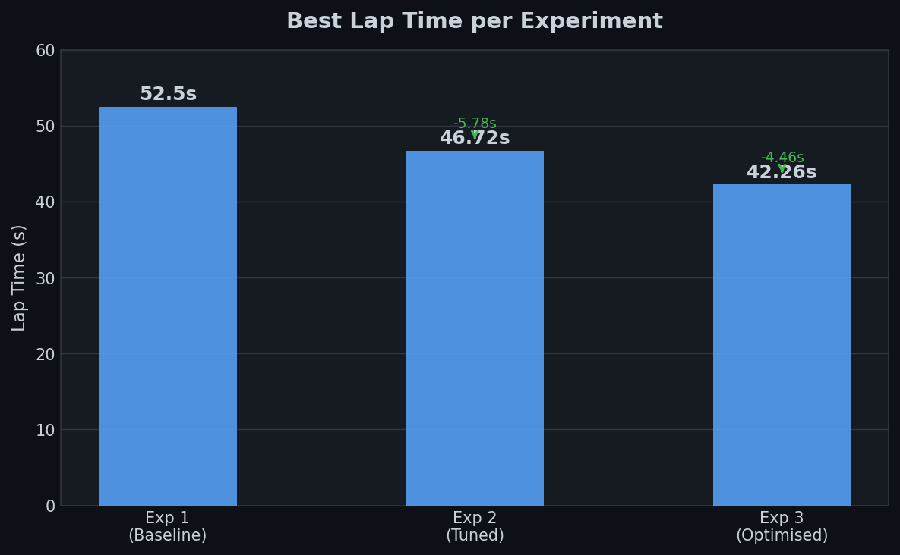
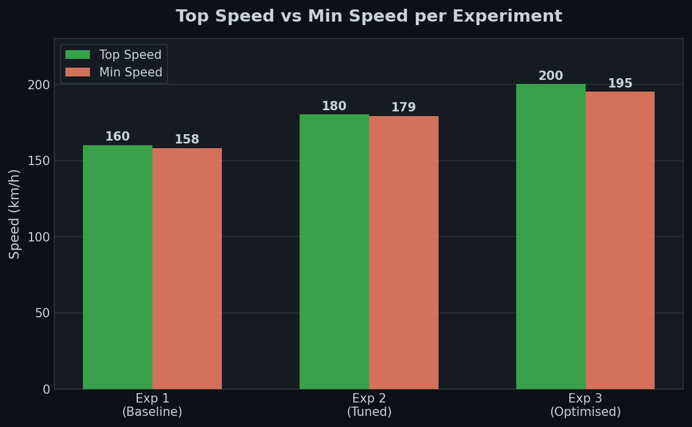

Copy this resutls file and paste it into your own repo to showcase your results! Lab results do not count towards your score you'll receive for your submission, but we encourage you to show off what you learned in the lab!
# Add your experiment results and reflections here

## First of all:
 
I'm a huge F1 fan and this hands on lab has been a joy to play with, secondarily as a python learner this hands on lab has been a great exercise to get a feel for how python scripts can interact with other programs and tools.

Thanks for a new lessons with docker (I was delaying that docker tutorial for a quite a while now)

As a racing fan it was great to see how the optimal racing line (which I have been studying for a while now) can be used to improve the lap times. ( all those youtube breakdowns look plausible now !)

## Results of my experiments:

### The defaults we are going for as given in the practice.xml file

1. Race Type / Menu: Practice
2. Track Category: oval
3. Track Name: Michigan
4. Number of Laps: 20

Parameters we are allowed to tweak and experiment with:

```python
TARGET_SPEED = 100 # Target speed in km/h. Increasing this makes the car go faster but may reduce stability.
STEER_GAIN = 30     # Steering sensitivity. Higher values make the car turn more aggressively.
CENTERING_GAIN = 0.20  # How strongly the car corrects its position toward the center of the track.
BRAKE_THRESHOLD = 0.9  # Angle threshold for b`raking. Lower values brake earlier.
GEAR_SPEEDS = [0, 20, 40, 80, 100, 180]  # Speed thresholds for gear shifting.
ENABLE_TRACTION_CONTROL = True  # Toggle traction control system.
```
## Experiment 1:

### Baseline run with the default parameters:

### Results:
1. Best time: 52.5s
2. Top Speed: 160km/h
3. Min speed: 158km/h

## Reflection:

1. The 2km/h spread between top speed (160) and min speed (158) shows the car holds its speed extremely consistently  -  Michigan's oval has no sharp corners, so the default parameters were stable, just slow.
2. `TARGET_SPEED = 100` is the bottleneck: the car was physically capable of going faster but was being held back by a ceiling set well below the track's potential. The gear shift points (`GEAR_SPEEDS`) were also mismatched  -  the car was spending too long in lower gears.
3. `STEER_GAIN = 30` caused slight wall contact on the banked oval turns, suggesting the steering was over-correcting at this speed. Reducing it should help.

## Experiment 2: Let's make the car go faster. 

we use the following parameters:

```python
TARGET_SPEED = 180       # Push the ceiling  -  Michigan's straights can handle it
STEER_GAIN = 20          # Reduce from 30; oval turns are gentle, less aggression needed
CENTERING_GAIN = 0.35    # Increase from 0.20; helps find the racing line through sweepers
BRAKE_THRESHOLD = 0.75   # Brake a little earlier (was 0.9) to set up cleaner exits
GEAR_SPEEDS = [0, 30, 60, 100, 140, 200]  # Shift thresholds scaled up to match new target speed
ENABLE_TRACTION_CONTROL = True  # Keep on for now
```

## Results:

1. Best time: 46.72s
2. Top Speed: 180km/h
3. Min speed: 179km/h

## Reflection:

1. The wall contact from Experiment 1 was resolved by dropping `STEER_GAIN` from 30 → 20. The narrower spread between top (180) and min (179) speed confirms the car is now taking the oval's banked turns cleanly without scrubbing speed.
2. A 5.78s improvement (52.5s → 46.72s) from simply raising the speed ceiling and rescaling the gear thresholds shows how much headroom the default parameters were leaving on the table.
3. The near-zero speed variance (180 vs 179 min) suggests the braking and centering are well-tuned for this oval  -  the car is carrying consistent speed through the whole lap, which is exactly what you want on Michigan.

## Experiment 3:

```python
TARGET_SPEED = 250      # Car is already hitting 180 comfortably, raise the ceiling again
STEER_GAIN = 15          # Dial down further:  at above 180km/h, even small steer inputs have big effect
CENTERING_GAIN = 0.60    # Slightly more line-seeking: min speed of 179 suggests it can handle it
BRAKE_THRESHOLD = 0.80   # A touch earlier: sets up cleaner apex at higher entry speed
GEAR_SPEEDS = [0, 70, 100, 150, 200, 250]  # Push shift points up to match the new ceiling
ENABLE_TRACTION_CONTROL = False  # disabling: at 179 min speed you're barely losing traction anyway

```

## Results:

1. Best time: 42.26s
2. Top Speed: 200km/h
3. Min speed: 195km/h

## Reflection:

1. Setting `TARGET_SPEED = 250` (above what the car achieves) effectively removes the artificial ceiling  -  the car finds its own physical limit and settles at ~200km/h, a further 20km/h gain over Experiment 2.
2. Disabling `ENABLE_TRACTION_CONTROL` at this speed caused no instability, which makes sense: Michigan is a smooth oval, and at 195km/h minimum speed the wheels are already fully loaded. TC would only help on a twisty track with sharp acceleration out of tight corners.
3. The gap between top (200) and min (195) speed widened slightly compared to Experiment 2, suggesting the higher entry speed into banked turns is introducing some speed loss  -  a track-specific tuning limit. On Michigan, we've likely reached the ceiling for pure parameter tuning without changing the steering logic itself.

---

## Results Summary

### Lap Time Improvement



### Speed Range per Experiment



---

## BUG REPORT 

( please excuse me if I am  wrong with any of my assumptions)

## Bug Found: Dead Code- Parameters Were Never Used

While experimenting with `torcs_jm_par.py`, I discovered a critical bug in the file structure: **the user-configurable parameters block at the bottom of the file was never actually being executed**.

### Root Cause

The file contained **two separate `if __name__ == "__main__"` blocks**:

```python
# --- BLOCK 1 (line ~477)  -  this ran first and exited ---
if __name__ == "__main__":
    C = Client(p=3001)
    for step in range(C.maxSteps, 0, -1):
        C.get_servers_input()
        drive_example(C)        # ← hardcoded target_speed = 160
        C.respond_to_server()
    C.shutdown()

# --- USER PARAMETERS (line ~493)  -  defined but never reached ---
TARGET_SPEED = 180
STEER_GAIN = 20
...

# --- BLOCK 2 (line ~542)  -  this never ran ---
if __name__ == "__main__":
    C = Client(p=3001)
    for step in range(C.maxSteps, 0, -1):
        C.get_servers_input()
        drive_modular(C)      
        C.respond_to_server()
    C.shutdown()
```

In Python, `if __name__ == "__main__"` is the program's entry point. When the script is run, the **first block executes and drives the car for the entire race**, meaning the second block and all the parameters defined between them never affect the car's behavior during any actual race run.

### Effect

Every run was silently using the old `drive_example()` function with a hardcoded `target_speed = 160`, ignoring all the tunable parameters entirely. Any changes to `TARGET_SPEED`, `STEER_GAIN`, etc. had **zero effect** on the car's behavior.

### Fix

Removed the first `if __name__ == "__main__"` block, so `drive_modular()` with the user-configurable parameters is the only active entry point.
